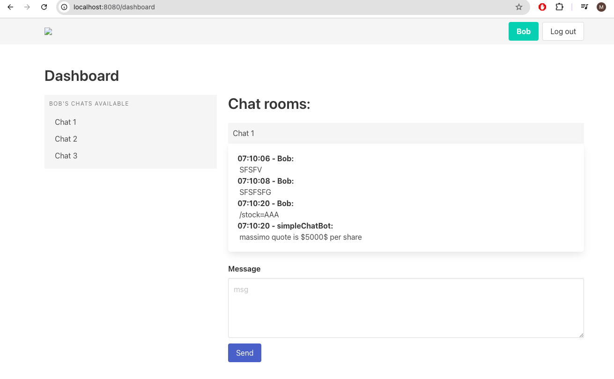
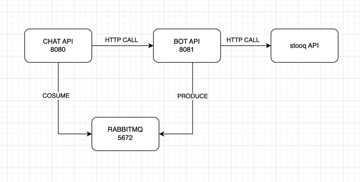

# How to run

## Requirements
1. Docker/Docker desktop
2. 8080(chat api), 8081(chat api bot) and 5672(rabbitmq) ports are available

## Steps

### How to run containers:

`./setup.sh`

### How to clean and remove containers

`./clean.sh`

---

#### `./setup.sh` will do the following:

1. Set up rabbitmq:
   1. `docker run -d --name rabbitmq -p 5672:5672 -p 15672:15672 rabbitmq:3-management`
2. Build Chat API
   1. `docker build -t simplechat -f Dockerfile .`
3. Run Chat API
   1. `docker run -d --name simplechatapi -p 8080:8080 simplechat`
4. Build BOT API
   1. `docker build -t simplechatbot -f BotAPIDockerFile .`
5. Run BOT API
   1. `docker run -d --name simplechatbotapi -p 8081:8081 simplechatbot`

## Users available (hardcoded) (user-pass)
1. Bob - 1111
2. Jimmy - 2222
3. Paul - 3333
4. Kat - 4444

## Bonus

### 1 Have more than one chatroom done
You can dynamically change the number of rooms in the DockerFile, currently set as 3: `CMD ["./server", "--rooms", "3"]`

### 2 Bot validations
Bot validations are visible in `bot/controllers/index.go` `generateMsg()` function

## Considerations

1. When I was doing my final tests `stooq.com` was down, so I was not able to fully test the code for it.
Please check `bot/controllers/index.go` where the CSV logic is commented in order to be able to run the program properly.
2. Due to running out of time I had to speed up the rabbitmq producer and consumer, so I hardcoded most of their configs.

# Examples

